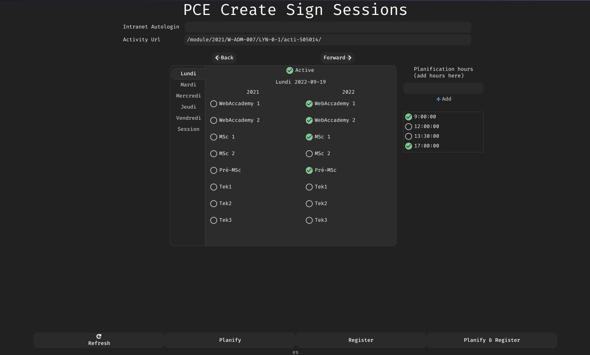

# EpitechEventPlanner
Event planner for epitech intranet.
The purpose of this tool is to create repeating events under a given activity



## Content
- Graphical User Interface created using pyGTK ([interface.py](./src/interface.py))
- Documentation generated using sphinx [Reference](https://julienaldon.github.io/EpitechEventPlanner/index.html#document-modules)
- Tests for the main [intranet](src/intranet.py) methods implementation and checker function ([tests.py](./src/tests.py))
- Command Line Interface ([__main__.py](./src/__main__.py)) (unstable)

## Install dependencies

For maintainability reason the project comes with a `pipenv` file describing all the dependencies and their version
```sh
pipenv install
```

# TODO: .desktop & cp executable

## GUI
The application comes with an interface made with pyGTK
```sh
pipenv run python src/interface.py
```
You can modify the interface widget by looking at the [Application.glade](./Application.glade)
It can be modified with [glade](https://glade.gnome.org/).

### Build the GUI
The application can be built by using the following command
```sh
pipenv run python src/setup.py
```
It should generate a build folder where you can find your executable.
```
./build/exe.linux-x86_64-3.9/EpitechEventPlanner
```

## CLI 
A Command Line Interface allow the user to quickly add events to an activity
See section usage for more info.
```sh
pipenv run python src
```

### CLI examples
```sh
pipenv run pyton . --promotion wac1 "2022-01-17" "2022-01-18"
```

```sh
Usage: 
create_sign_sessions.py [-h] --promotion promotion [--events [events ...]] [dates in %Y-%m-%d ...]

Select promotions and dates or events

Positional arguments:
  dates in %Y-%m-%d

Optional arguments:
  -h, --help            show this help message and exit
  --promotion promotion, -p promotion
  --events [events ...]
```

The script must be executed with dates first (to create the events)
The created events must be printed on the standard output.
You can use this list to add some more promotions to the given events with `--events` flag.

## Tests
The application have some basic unit tests using python unittest
```sh
pipenv run python src/tests.py -v
```
`-v` is optionnal, it shows more informations.

## Documentation
The documentation is inside the [docs](docs) folder, the branch `docs` is dedicated to the documentation deployment on github pages [here](https://julienaldon.github.io/EpitechEventPlanner/). 


### Build the documentation
```
git checkout docs
make
```
This should update [`_static`](_static) and [`index.html`](index.html)
